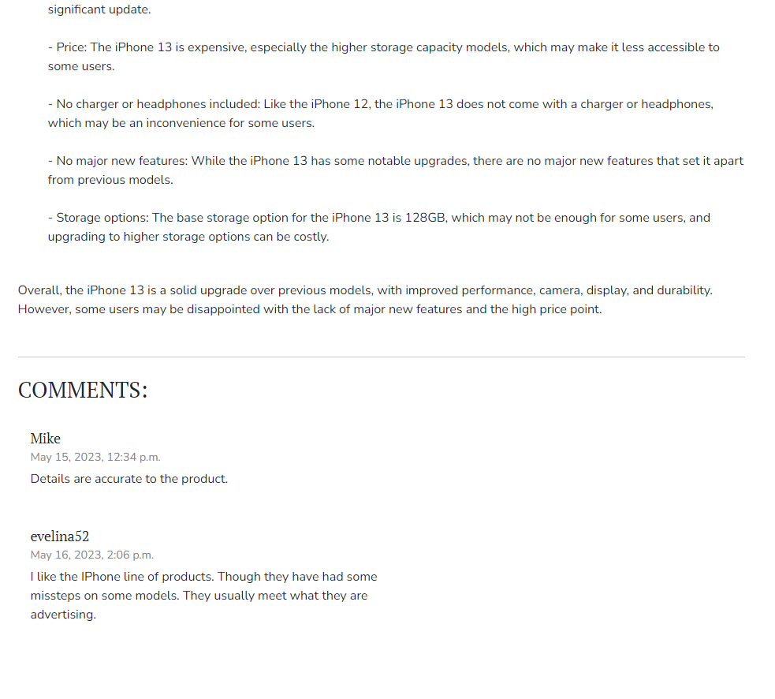
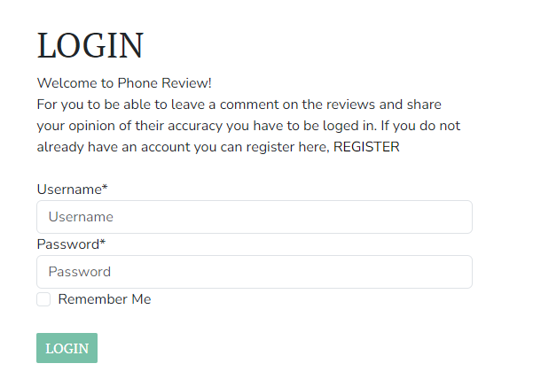
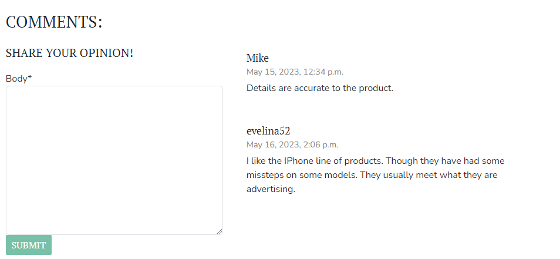
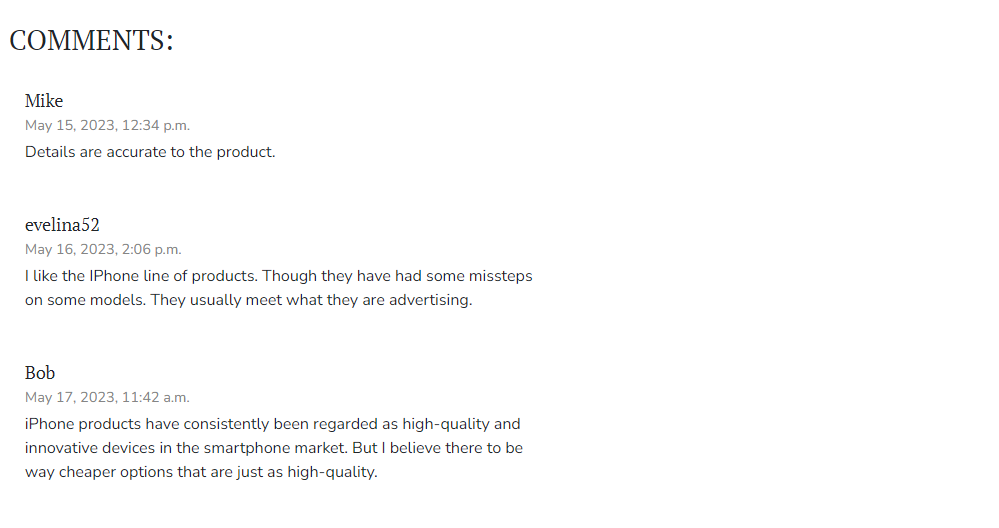
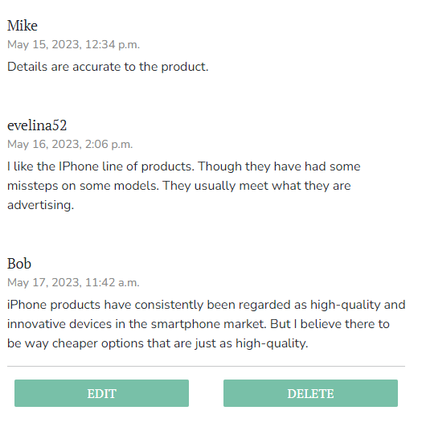
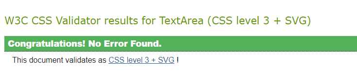

# Phone Review

Phone reviews is a review page for phones of all different models. It is an open space to share your opinion of both the review and the product in question. Just register an account and login to share through the comments on the review of your choice.

 !!!!!!!!!

The live link can be found [HERE](https://phone-review.herokuapp.com/)

## Table of Contents

+ [UX](#ux "UX")
  + [Site Purpose and Goals](#site-purpose-and-goals "Site Purpose and Goals")
  + [Audience](#audience "Audience")
  + [Communication](#communication "Communication")
+ [User Stories](#user-stories "User Stories")
  + [Admin stories](#admin-stories "Admin stories")
  + [Visitor stories](#visitor-stories "Visitor stories")
+ [Design](#design "Design")
  + [Colour Scheme](#colour-scheme "Colour Scheme")
  + [Typography](#typography "Typography")
  + [Imagery](#imagery "Imagery")
+ [Features](#features "Features")
  + [Existing Features](#existing-features "Existing Features")
  + [C.R.U.D](#crud "C.R.U.D")
+ [Testing](#testing "Testing")
  + [Validator Testing](#validator-testing "Validator Testing")
  + [Unfixed Bugs](#unfixed-bugs "Unfixed Bugs")
+ [Technologies Used](#technologies-used "Technologies Used")
  + [Main Languages Used](#main-languages-used "Main Languages Used")
  + [Frameworks, Libraries & Programs Used](#frameworks-libraries-programs-used "Frameworks, Libraries & Programs Used")
+ [Deployment](#deployment "Deployment")
+ [Credits](#credits "Credits")
  + [Content](#content "Content")

## UX

### Site Purpose and Goals

The sites purpose is to provide an open space to share your opinion of both the review and the product in question, for both the admin and the site user. And to give a insight in the products that are avalible on the market. So that site users can manke a purchase with more wellrounded information about the product.  

### Audience

The site is intended for everyone with either an interest in the phone market or those in search for more information of a certain product before purchase. The expected audiance age range between 20-50 years of age

### Communication

The site is set up using a simple but clear layout and navigation to make it easy for both site user and asmin to find their way around.

### Future Goals

## User Stories

Not all stories have been implemented. Some have been left for future implementations as the site grows and expands.

### Admin stories

#### As an admin

+ I can **create draft versions of a review** so that **I can finish writing a review later without having to post it**
+ I can **add, edit and delete product ratings** so that **site users have access to the latest ratings and information**
+ I can **see comments on a review** so that **I can understand what others think of the product and review**

### Visitor stories

#### As a visitor

+ I can **create an account on the site** so that **I can comment and take part of the community and the rating**
+ I can **leave, edit and delete comments on reviews** so that **I can provide personal insight on the product for others**
+ I can **see comments on a review** so that **I can understand what others think of the product and review**

Yet to be implemented,

+ As a **Site User** I can **view the posted ratings** so that **I can get more information of the review accuracy**
+ As a **Site User** I can **take part in voting for the next product to be rated** so that **I can get insight on a product that I’m interested in**
+ As a **Site User** I can **search for products on the site** so that **I can find items fast and easily*

## Design

### Wireframes


##### Home Page


##### Review Details


### Database Schema ?

### Colour Scheme

### Typography

The fonts were obtained from the Google Fonts library. I chose the following fonts for the page:

+ "PT Serif"
+ "Nunito Sans"

### Imagery

The images were obtained from Pexels. The following where used:

+ [Home page image](https://www.pexels.com/photo/closeup-photo-of-silver-iphone-7-plus-with-earpods-1038628/) - [PhotoMIX Company](https://www.pexels.com/@wdnet/)
+ [Iphone 13 image](https://www.pexels.com/photo/iphone-mockup-stationery-office-douglas-mendes-pexels-16228406/) - [Douglas Mendes](https://www.pexels.com/@doouglasma/)
+ [Huawei image](https://www.pexels.com/photo/black-huawei-android-smartphone-1036619/) - [Alex Fu](https://www.pexels.com/@alexfu/)
+ [Samsung s10 image](https://www.pexels.com/photo/black-samsung-android-smartphone-on-top-of-brown-wooden-tablke-214487/) - [John Tekeridis](https://www.pexels.com/@john-tekeridis-21837/)
+ [Iphone X image](https://www.pexels.com/photo/black-iphone-11-beside-airpods-and-coffee-cup-3250815/) - [Richard Balane](https://www.pexels.com/@richard-balane-808703/)

## Features

### Existing Features

#### Home Page


#### Navigation Bar

##### Desktop


##### Mobile


#### Review Details Page




#### Log in, Log out & Sign up

##### Login



##### Logout


##### Sign-up


### C.R.U.D



#### Create


#### Read

( This picture is taken as a viewer that is not logged in )



#### Update and Delete



### Features Left to Implement

+ Up- and Downvote reviews
+ Vote on next review product
+ Search function

## Testing

+ Static files not loading on heroku:

- Deployment to heroku failed due to staic files failing to load (etag Error).
+ Was solved by runing the command ```python3 manage.py collectstatic``` and adding the *X_FRAME_OPTIONS* key with *'SAMEORIGIN'* as value.

+ Django error message after adding comment form:

- When adding the comment function crispy did not want to load.
+ The problem was found to be that the wrong version of crispy was installed, and so it was uninstalled and the right version installed in it's place.

+ Submit multiple comments:

- When adding the function to edit comments the comment model was edited to create a unique id for each one. But this did not work and resulted in an inability to comment (as the id for the comments were the same).
+ This was solved by simply reverting back to the models default id method.
  
<hr>

| User story testing  | Does the functionality exist?  | If not why? |
| ------------- | ------------- | ------------- |
| As a **Site Admin** I can **create draft versions of a review** so that **I can finish writing a review later without having to post it**  | Yes  |  |
| As a **Site Admin** I can **add, edit and delete product ratings** so that **site users have access to the latest ratings and information**  | Yes  |  |
| As a **Site User / Admin** I can **see comments on a review** so that **I can understand what others think of the product and review**  | Yes  |  |
| As a **Site User** I can **create an account on the site** so that **I can comment and take part of the community and the rating**  | No  | The rating function is yet to be implemented. Otherwise the user story is complete |
| As a **Site User** I can **leave, edit and delete comments on reviews** so that **I can provide personal insight on the product for others**  | Yes  |  |
| As a **Site User** I can **search for products on the site** so that **I can find items fast and easily**  | No  | The functon has yet to be implemented |
| As a **Site User** I can **take part in voting for the next product to be rated** so that **I can get insight on a product that I'm interested in**  | No  | The functon has yet to be implemented |
| As a **Site User** I can **view the posted ratings** so that **I can get more information of the review accuracy**  | No  | The functon has yet to be implemented |
<hr>

+ Testing CRUD functionality:

+ Each of the features were tested multiple times to ensure that numerous new comments could be submitted, and that each comment had the ability to be updated, edited and deleted by the creator.
+ If a comment is submitted by another user, the edit/delete buttons does not appear on the commet.

### Validator Testing

+ html files pass through the [W3C validator](https://validator.w3.org/) with no html issues found

+ Errors listed only reference  & {{}} tags.

+ CSS files pass through the [Jigsaw validator](https://jigsaw.w3.org/css-validator/) with no issues found.



+ Lighthouse


+ Python files passed through [PEP8](https://pep8ci.herokuapp.com/) with no issues found.


+ Tested the site opens in Chrome & Safari without issues.

### Unfixed Bugs

## Technologies Used

### Main Languages Used

+ HTML5
+ CSS3
+ Python
+ Django
+ SQL - Postgres ?

### Frameworks, Libraries & Programs Used

+ Google Fonts - was used for the font families "PT Serif" and "Nunito Sans".
+ Font Awesome - was used to add the icon to indicate number of comments on a review.
+ Pexels - was used to provide the site with free photos.
+ Codeanywhere - was used for my IDE.
+ GitHub - was used to store my repository.
+ Balsamiq - was used to create mockups of the project prior to starting.
+ Am I Responsive? - was used to ensure the project looked good across all devices and provide a visual representation of this.
+ Django
+ Bootstrap

### Installed Packages

+ 'django<4' gunicorn
+ dj_database_url psycopg2
+ dj3-cloudinary-storage
+ django-summernote
+ django-allauth
+ django-crispy-forms

## Deployment

The site was deployed to Heroku using the following steps:

+ Install Django & Gunicorn:
```pip3 install 'django<4' gunicorn```
+ Install Django database & psycopg:
```pip3 install dj_database_url psycopg2```
+ Install Cloudinary:
```pip3 install dj3-cloudinary-storage```
+ Create the requirements.txt file with the following command:
```pip3 freeze --local > requirements.txt```
+ a django project was created using:
```django-admin startproject printstatements.```
+ the blog app was then created with:
```python3 manage.py startapp blog```
+ which was then added to the settings.py file within our project directory.
+ the changes were then migrated using:
```python3 manage.py migrate```
+ navigate to [Heroku](www.heroku.com) & created a new app called print-statements.
+ add the Heroku Postgres database to the Resources tab.
+ navigate to the Settings Tab, to add the following key/value pairs to the configvars:

1. key: SECRET_KEY | value: randomkey
2. key: CLOUDINARY_URL | value: API environment variable
3. key: HEROKU_POSTGRESQL_MAROON_URL | value: value supplied by Heroku
4. key: DATABASE_URL | value: Database enviroment variable

+ add the DATABASE_URL, SECRET_KEY & CLOUDINARY_URL to the env.py file
+ add the DATABASE_URL, SECRET_KEY & CLOUDINARY_URL to the settings.py file
+ add an import os statement for the env.py file in the settings.py
+ add the Heroku app to the ALLOWED_HOSTS in settings.py
+ add X_FRAME_OPTIONS key with 'SAMEORIGIN' as value in the settings.py file.
+ collect the static files using: ```python3 manage.py collectstatic```
+ create the Procfile for [Heroku](www.heroku.com)
+ push the project to Github
+ connect github account to Heroku through the Deploy tab
+ connect my github project repository, and then clicked on the "Deploy" button

## Credits

### Content

+ [Martina Terlevic](https://github.com/SephTheOverwitch): My mentor who calmed me down in a state of panic and calmly described what was needed for the project. So that I had a plan going forward.
+ [Oscar Johansson](https://github.com/OskarJ1993): For being a rock throughout this course and being a support pillar.
+ “I think therefore I blog” walkthrough: Provided the initial steps for setting up & deploying the site. As well as using the instructions they provided in order to implement a django blog into my app, following the walkthrough once again step-by-step. This also includes, but is not limited to, some formatting for the way each blog post is displayed on the blog page and the comment model. Credits have been added as comments where code was used.
+ "I think therefore I blog" + "Hello Django" + Slack + Stackoverflow + [Martina Terlevic](http://github.com/SephTheOverWitch): aided in the creation of the CRUD function centered on the comments.
+ Adam from Tutor support: assisting in deciphering why crispy caused an error.
+ Joanne from Tutor support: assisting in deploying to heroku and explaining the "etag" error.
+ [Bootstrap](https://getbootstrap.com/docs/5.2/components/dropdowns/): dropdown nav menu.
